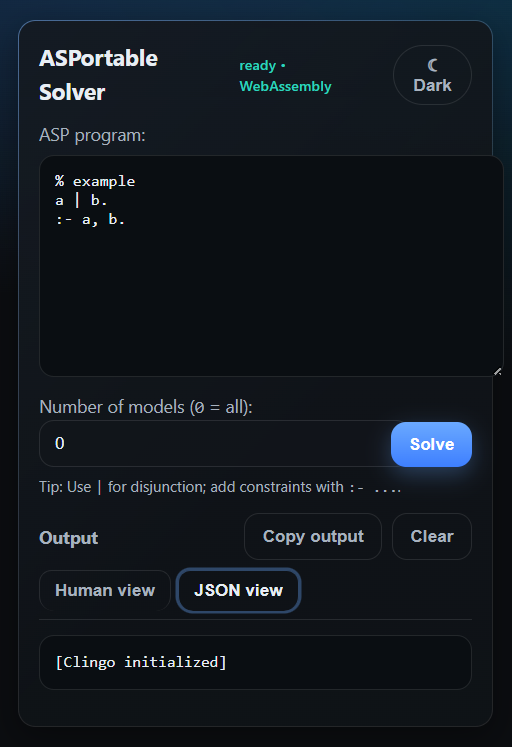

# ASPortable Solver 🔮

**ASPortable Solver** is a lightweight **Answer Set Programming (ASP)** playground that runs entirely in your browser.  
Powered by [clingo-wasm](https://github.com/potassco/clingo-wasm), it brings the reasoning power of [clingo](https://potassco.org/clingo/) directly into a simple, portable **Chrome Extension** — no installation, no backend, fully offline.  

---

## ✨ Features

- 🖥️ **Runs offline** — clingo compiled to WebAssembly, right inside your browser  
- ⚡ **Fast & portable** — instant solving in a popup window  
- 📚 **ASP playground** — test rules, constraints, and answer sets on the fly  
- 🎨 **Minimal UI** — type, solve, and see results instantly  
- 🔒 **Private & secure** — no data leaves your computer  

---

## 🚀 How to Use

1. Install **ASPortable Solver** from the **[Chrome Web Store](#)**  
2. Click the extension icon in your toolbar  
3. Type or paste your ASP program into the editor  
4. Set the number of models (`0 = all`)  
5. Hit **Solve** and view the answer sets instantly  

---

## 🧩 Example

**Program:**
```prolog
a | b.
:- a, b.
```

**Output:**
```
Answer set 1: {a}
Answer set 2: {b}
```

---

## 📷 Preview



---

## 🛠️ Technology

- **clingo-wasm** — ASP solver compiled to WebAssembly  
- **Chrome Extension MV3** — modern, secure extension architecture  
- **JavaScript / HTML / CSS** — simple and efficient UI  

---

## 🧭 Roadmap

- [ ] Syntax highlighting in the editor  
- [ ] Export results to JSON/CSV  
- [ ] Upload and solve `.lp` files  
- [ ] Firefox extension port  

---

## 🙌 Credits

- [Potassco](https://potassco.org/) for developing **clingo** and providing the WebAssembly build  
- The **ASP community** for inspiring this project  

---

## 📜 License

Released under the **MIT License**.  
See [LICENSE](./LICENSE) for details.
